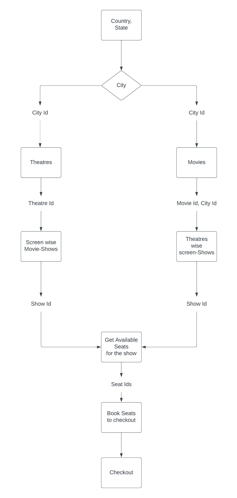
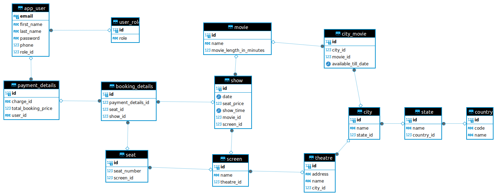

# Project Title

<b>MovieNow: Movie Ticket Booking System</b>

## Table of Contents

- [Project Title](#project-title)
    - [About](#about)
    - [Features](#features)
    - [Technologies Used](#technologies-used)
    - [Flowcharts](#flowcharts)
    - [Upcoming Features](#ongoing-or-upcoming-features)

## About

Movie Ticket Booking System is crafted with a backend-centric approach focused on functionality, designed to streamline the process of managing and reserving movie tickets. Developed using robust Spring Boot framework, It ensures optimal performance and reliability in handling ticket reservations, elevating the overall movie-watching experience for users.

MovieNow integrates an email service to send automated confirmation emails upon ticket reservation, ensuring users are promptly notified of their booking details.

MovieNow utilizes a multi-stage Dockerfile to minimize image size, resulting in reduced deployment response times. The system is deployed on Amazon Web Services (AWS) Elastic Kubernetes Service (EKS) infrastructure, orchestrated through a Continuous Integration/Continuous Deployment (CI/CD) pipeline, ensuring seamless and efficient deployment processes.

Includes various deployment YAMLs for deploying PostgreSQL and RabbitMQ as stateful sets within the same AWS EKS environment, ensuring data persistence and efficient resource utilization.

## Features

<b>Theater and Movie Listings:</b> Retrieve information about theaters and movies available in a city, facilitating informed decision-making for users.

<b>Concurrent Ticket Booking:</b> Handles concurrency issues by implementing record expiry feature in Redis, by booking seats temporarily for some time(6 mins) to prevent booking of same tickets by other person.

<b>Asynchronous Email Service:</b> Improves response time of the checkout API by implementing an asynchronous email service with concurrent workers using RabbitMQ messaging queue, enhancing user experience.

<b>Caching Mechanism:</b> Reduce database calls and enhance performance by implementing caching for frequently called API endpoints with lower insertion rates, leveraging Redis cache feature.

<b>Containerization:</b> Used Multi-stage Dockerfile to minimize image size and decrease deployment time through multi-stage Docker builds, enhancing deployment efficiency.

<b>CI/CD Pipeline:</b> Automation of deployment to AWS EKS by building a CI/CD pipeline using GitHub Actions, ensuring seamless and efficient deployment processes.

<b>Storage Persistence:</b> Storage persistence for Postgres database and RabbitMQ  loss  in EKS using StatefulSet objects, preventing data loss and ensuring data integrity.

## Technologies Used

- Spring Boot Framework
- Rabbit-MQ 
- Docker
- AWS Elastic Kubernetes Service EKS for Container Orchestration
- REDIS-cache
- CI/CD pipeline for Deployment automation

## Flowcharts

Flowcharts illustrating the project architecture or workflow:

### User-role Flowchart

### Database Schema

## Ongoing or Upcoming Features

### Features

- **Caching**: Implementing caching for rest of the appropriate APIs while maintaining data consistency.

- **API Documentation**: Implementing SWAGGER for API Documentation.
- **SPRING Bean Validation**: To implement bean validation to validate request objects or the data to be saved in DB.
