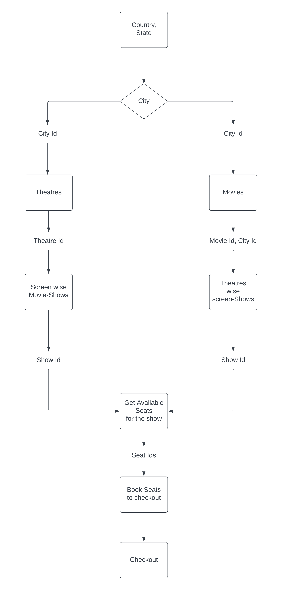
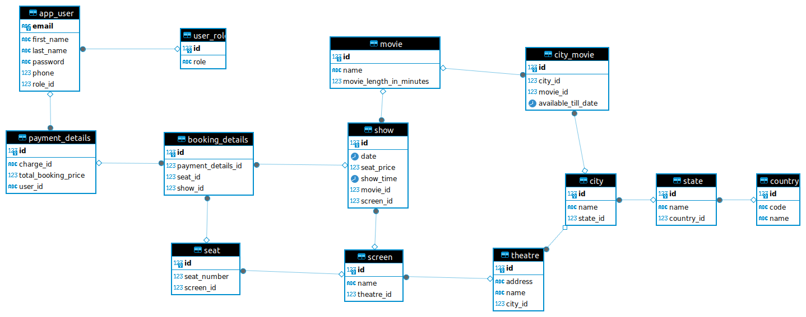

<div align="center">

<br/>

<h1>
  
</h1>

<p>
  
</p>

<h3>
  <p>A backend-centric movie ticket booking system — handles concurrent seat reservations, async email notifications, Redis-based caching, and fully automated deployments on AWS EKS via CI/CD pipelines.</p>
</h3>

<br/>

<p>
  
  
  
  
  
  
  
  
  
  
</p>

<br/>

</div>

---

## ✨ Key Features

| Feature | Description |
|---|---|
| 🎟️ **Concurrent Ticket Booking** | Redis-based seat reservation locks (6 min TTL) prevent double-booking across concurrent requests |
| 📧 **Async Email Notifications** | RabbitMQ-powered email service with concurrent workers — checkout API returns instantly |
| 🏙️ **Theater & Movie Listings** | Query theaters and movies by city with optimized, cached responses |
| ⚡ **Redis Caching** | Frequently accessed, low-write endpoints cached in Redis to reduce DB load |
| 🐳 **Multi-Stage Docker Builds** | Minimized image size for faster deployments and reduced CI/CD pipeline duration |
| ☸️ **AWS EKS Deployment** | Kubernetes StatefulSets for PostgreSQL and RabbitMQ ensure data persistence on EKS |
| 🔄 **CI/CD Pipeline** | Fully automated deployments to AWS EKS via GitHub Actions |
| 💾 **Storage Persistence** | StatefulSet objects for PostgreSQL and RabbitMQ prevent data loss across pod restarts |

---

## 🏗️ System Architecture

```
                                👤 User
                                   │
                                   ▼
                          ⚡ Spring Boot API
                         /                  \
               Browse / Search          Checkout / Book
                      /                          \
                     ▼                            ▼
            🎬 Movie & Theater              🔐 Seat Reservation
              Listings API                       │
                     │                           ▼
                     ▼                   🔴 Redis Lock
              ⚡ Redis Cache             (6 min TTL per seat)
         (low-write endpoints)                   │
                                                 ▼
                                        🐘 PostgreSQL
                                      (Confirm Booking)
                                                 │
                                                 ▼
                                       📨 RabbitMQ Queue
                                                 │
                                                 ▼
                                    📧 Async Email Workers
                                  (Booking Confirmation Email)
```

---

## 🔴 Concurrent Booking — How It Works

The core challenge: two users booking the same seat at the same time.

**Solution: Redis TTL-based seat lock**

```
User A requests Seat 12A
       │
       ▼
SET seat:12A:lock "userA" EX 360   ← Redis lock (6 min TTL)
       │
  Lock acquired?
  /           \
YES             NO
 │               │
 ▼               ▼
Proceed      Return "Seat
to checkout  unavailable"
       │
       ▼
Payment confirmed → Write to PostgreSQL → Release lock
       │
       ▼
Push to RabbitMQ → Email worker → Send confirmation
```

If the user abandons checkout, the Redis lock **expires automatically after 6 minutes**, freeing the seat for others — no manual cleanup required.

---

## 📧 Async Email Service

Booking confirmation emails are fully decoupled from the checkout flow via RabbitMQ.

```
POST /checkout
      │
      ▼
Confirm booking in DB
      │
      ▼
Publish message to RabbitMQ ──→ Return 200 immediately to user
      │
      ▼ (async)
Email Worker (concurrent consumers)
      │
      ▼
Send confirmation email to user
```

**Why this matters:** The checkout API response time is not blocked by email delivery. Even if the email service is slow or temporarily down, the booking is confirmed and the message stays in the queue.

---

## 🛠️ Tech Stack

| Layer | Technology |
|---|---|
| **API** | Spring Boot · REST |
| **Concurrency** | Redis (TTL-based seat locks) |
| **Caching** | Redis Cache |
| **Async Messaging** | RabbitMQ |
| **Database** | PostgreSQL |
| **Containerization** | Docker (Multi-Stage Builds) |
| **Orchestration** | Kubernetes (AWS EKS) |
| **Persistence** | Kubernetes StatefulSets |
| **CI/CD** | GitHub Actions |
| **Cloud** | AWS EKS |

---

## 🔍 API Overview

### Movies & Theaters
| Method | Endpoint | Description |
|---|---|---|
| `GET` | `/cities` | List all available cities |
| `GET` | `/cities/{cityId}/theaters` | Get theaters in a city |
| `GET` | `/theaters/{theaterId}/movies` | Get movies showing at a theater |
| `GET` | `/movies/{movieId}/shows` | Get show timings for a movie |

### Booking
| Method | Endpoint | Description |
|---|---|---|
| `POST` | `/shows/{showId}/reserve` | Reserve seats (Redis lock, 6 min TTL) |
| `POST` | `/bookings/checkout` | Confirm booking + trigger async email |
| `GET` | `/bookings/{bookingId}` | Get booking details |
| `DELETE` | `/bookings/{bookingId}` | Cancel booking + release seat lock |

---

## ☸️ Kubernetes Deployment

PostgreSQL and RabbitMQ are deployed as **StatefulSets** inside the same AWS EKS cluster to ensure:
- **Stable network identity** — pods get consistent DNS names
- **Persistent storage** — data survives pod restarts via PersistentVolumeClaims
- **Ordered deployment** — guaranteed startup sequence

```
AWS EKS Cluster
├── Deployment: movieNow-api          (Spring Boot — scalable, stateless)
├── StatefulSet: postgresql           (persistent volume for booking data)
├── StatefulSet: rabbitmq             (persistent volume for message queue)
└── CI/CD: GitHub Actions             (auto-deploy on push to main)
```

---

## 🔄 CI/CD Pipeline

```
Push to main
      │
      ▼
GitHub Actions triggered
      │
      ├── Build multi-stage Docker image
      ├── Push to container registry
      └── Deploy to AWS EKS
              │
              ▼
        Rolling update
      (zero downtime deployment)
```

Multi-stage Docker builds keep the final image lean by separating the build environment from the runtime environment — resulting in significantly smaller image sizes and faster pull times during deployment.

---

## 🗄️ Database Schema

```
cities
 └── theaters
      └── movies
           └── shows
                └── bookings
                     └── booked_seats
```

```
users
 └── bookings  (userId · showId · status · createdAt)
      └── booked_seats  (seatId · bookingId)

shows  (movieId · theaterId · showTime · totalSeats · availableSeats)
seats  (showId · seatNumber · type · price)
```

### User Flow


### Database Schema


---

## 🚀 Setup & Running

### Prerequisites
- Java 17+
- Docker
- kubectl + AWS CLI (for EKS deployment)

### 1. Start Infrastructure
```bash
docker compose up -d   # Starts PostgreSQL + RabbitMQ + Redis
```

### 2. Run the Application
```bash
./mvnw spring-boot:run
# API available at http://localhost:8080
```

### 3. Deploy to AWS EKS
```bash
# Apply Kubernetes manifests
kubectl apply -f k8s/postgresql-statefulset.yaml
kubectl apply -f k8s/rabbitmq-statefulset.yaml
kubectl apply -f k8s/movieNow-deployment.yaml
```

Or simply push to `main` — GitHub Actions handles the rest.

---

## 🔑 Environment Variables

```bash
# Database
SPRING_DATASOURCE_URL=jdbc:postgresql://localhost:5432/movienow
SPRING_DATASOURCE_USERNAME=postgres
SPRING_DATASOURCE_PASSWORD=...

# Redis
SPRING_REDIS_HOST=localhost
SPRING_REDIS_PORT=6379

# RabbitMQ
SPRING_RABBITMQ_HOST=localhost
SPRING_RABBITMQ_PORT=5672
SPRING_RABBITMQ_USERNAME=guest
SPRING_RABBITMQ_PASSWORD=guest

# Email
MAIL_HOST=smtp.gmail.com
MAIL_USERNAME=...
MAIL_PASSWORD=...
```

---

## 💡 What Makes This Stand Out

- **Race condition handling without DB locks** — Redis TTL-based seat reservation is lighter and faster than pessimistic DB locking, and self-heals on abandoned checkouts.
- **Checkout API latency is email-independent** — RabbitMQ decoupling means a slow email provider never degrades the booking experience.
- **Production-grade infra** — StatefulSets, PVCs, rolling deployments, and CI/CD from day one, not bolted on later.
- **Multi-stage Docker** — build artifacts stay out of the final image, keeping it lean for faster EKS pull times.

---

## 🔮 Upcoming Features

- **Full API Caching** — Extend Redis caching to remaining read-heavy endpoints while maintaining consistency
- **API Documentation** — Swagger/OpenAPI integration for full endpoint documentation
- **Bean Validation** — Spring Validation annotations on all request objects for consistent input integrity

---

*Built with Spring Boot · Redis · RabbitMQ · PostgreSQL · Docker · AWS EKS · GitHub Actions*
